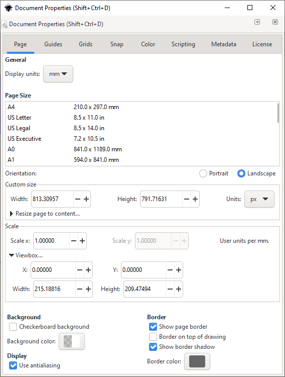
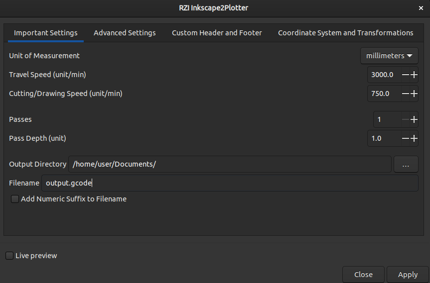
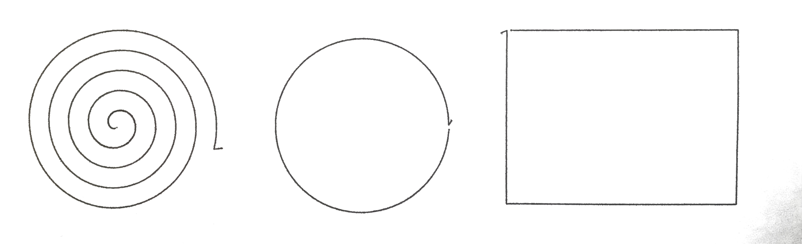
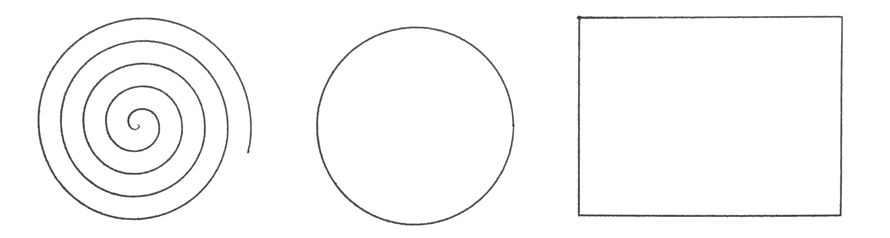

# RZI Inkscape2Laser

A clone of [J-Tech-Photonics-Laser-Tool](https://github.com/JTechPhotonics/J-Tech-Photonics-Laser-Tool)

This Inkscape extension generates gcode for laser cutters and plotting machines from an SVG file.

Version 1.0 released!
on the [releases page](https://github.com/RZItech/RZI-Inkscape2Plotter/releases).

This extension is essentially a UI wrapped around the [svg_to_gcode](https://github.com/PadLex/SvgToGcode) library.
So if you want to learn how an Inkscape extension is structured, look no further.
If you're interested in peeking under the hood, check out svg_to_gcode.

## Installation

Download the latest release [here](https://github.com/RZItech/RZI-Inkscape2Plotter/releases/latest).
Inkscape versions below 1.0 are not supported.

Unzip the binaries and copy the laser directly into the Inkscape **user extensions folder**. Inkscape lists the location
of your user extensions folder under **Edit/Inkscape** > **Preferences** > **System**.

Restart Inkscape and you're done.

## Tutorial

### Document Setup

Before using the extension, we need to make sure the document is setup correctly. Open **File** > **Document Properties**.

Set the document's **display units** to `mm` or `in`.
Then set **Scale x**, **Scale y** to `1` and **Viewbox > X**, **Viewbox > Y** to `0`.

Lastly, you can move and rescale your drawing to make it look like it did before.

### Basic Usage

This extension will parse all svg paths and ignore everything else.

**Step 1 is to convert all other shapes to paths.** In this case I want to convert the whole drawing to gcode.
So I select everything `CTRL+A` and convert the drawing to paths
**Path** > **Object to Path**.

Open the extension at **Extension** > **Generate Plotter Gcode** > **RZI Inkscape2Plotter**

Select the **same unit** you used in the **Document Settings**. Then choose an appropriate output directory and
hit apply.

**The tool up/down delay is automatically set to 0.5**

On pen plotters, this allows the pen to go up/down fully before moving, preventing markings.

**Without delay 👇️**

**With delay 👇️**

You'll notice two layers were added to your document:

* `debug reference points` contains the black corners. They
   represent the four corners of your machine's bed. You can use them to eyeball whether the gcode is scaled and placed
   correctly.
* `debug traces` contains the red paths which trace all generated gcode commands.

Note: debug layers are reset everytime you run the extension. So make sure you don't accidentally add any objects to them
or they will be deleted.

## Contribute

* As a user you can contribute by suggesting features, testing the library and reporting any bugs you encounter in a
   detailed issue.
* As a developer of any skill level you can make pull requests which close issues or introduce useful features.
   Just make sure to create an issue describing what features you want to add before taking the time to implement them.
